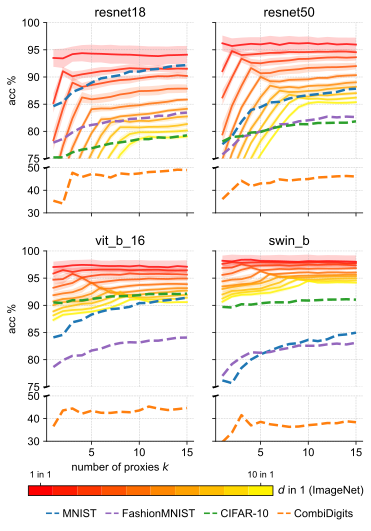

# Robust Weight Imprinting
This repository contains code for the paper **Robust Weight Imprinting: Insights from Neural Collapse and Proxy-Based Aggregation**.
[[Preprint](https://arxiv.org/abs/2503.14572)] [[TMLR Publication](https://openreview.net/forum?id=duU11BnQ3Y)] [[Video Presentation](https://youtu.be/d5cMBYjOAdQ)]

## Overview of our `IMPRINT` Framework
We test frozen, neurally collapsed foundation models (`FMs`) on transferability to new classes.
The weight generator (`GEN`) uses training data from a novel task `T` to consecutively generate one or more weight vectors (proxies) per class $1, \dotsc, c$ in `T`.
In inference, the final output for the test data in `T` is computed by an aggregation (`AGG`) mechanism.
Embeddings and generated weights are normalized according to `NORMpre` and `NORMpost`, respectively.
During inference, embeddings are normalized according to `NORMinf`.


For more details on the framework implementation and components, please refer to the paper.

## Setup and Running Experiments
There are three main ways to run the experiments reproducing the results in our paper with this repository:
1. Local setup with a virtual environment
2. Docker container
3. (in conjunction with 2.) Kubernetes cluster for large-scale parallel execution

### Local Setup
```bash
# Tested with Python3.10

# Create and activate virtual environment
python -m venv venv
source venv/bin/activate  # On macOS/Linux or venv\Scripts\activate on Windows

# Install requirements
pip install -r requirements.txt

# Install the package in development mode
pip install -e .

# Generate embeddings (required before running experiments)
python scripts/generate_embeddings.py

# Now you can run experiments, e.g., reproduce the results from the first results subsection
python scripts/run_imprinting_experiments.py --config src/config/config_reprod_subsec1_aggfixed.yaml
```

### Docker and Kubernetes Setup
To run this across a Linux cluster with Kubernetes for large-scale parallel execution, build a Docker container via

```bash
docker build -t imprinting . --platform=linux/amd64
```

push it to your desired registry via

```bash
docker push <registry-name>/imprinting
```

and then, use (for example) the Kubernetes job generator:

```bash
# Navigate to the k8s directory
cd k8s

# Generate job files for a specific configuration
python imprinting_jobs_generator.py

# Apply the generated job files
kubectl apply -f generated_imprinting_jobs_reprod/
```

The jobs will run in parallel on your Kubernetes cluster, with results stored in the configured persistent volume.


## Reproducing Experiments from the Paper

To reproduce all the experiments from our paper, run the following configuration files using the `run_imprinting_experiments.py` script:

```bash
# Section 5.1 (including Table 1)
python scripts/run_imprinting_experiments.py --config src/config/config_reprod_subsec1_aggfixed.yaml
python scripts/run_imprinting_experiments.py --config src/config/config_reprod_subsec1_aggfixed_kls.yaml
python scripts/run_imprinting_experiments.py --config src/config/config_reprod_subsec1_aggfocus.yaml
python scripts/run_imprinting_experiments.py --config src/config/config_reprod_subsec1_aggfocus_kls.yaml

# Figure 6
python scripts/run_imprinting_experiments.py --config src/config/config_reprod_fig6.yaml

# Section 5.2
python scripts/run_imprinting_experiments.py --config src/config/config_reprod_subsec2.yaml
python scripts/run_imprinting_experiments.py --config src/config/config_reprod_subsec2_kls.yaml

# Section 5.3 for ImageNet
python scripts/run_imprinting_experiments.py --config src/config/config_reprod_subsec3_imagenet.yaml
python scripts/run_imprinting_experiments.py --config src/config/config_reprod_subsec3_imagenet_kls.yaml

# Section 5.3 for CombiDigits dataset
python scripts/run_imprinting_experiments.py --config src/config/config_reprod_subsec3_combidigits.yaml
python scripts/run_imprinting_experiments.py --config src/config/config_reprod_subsec3_combidigits_kls.yaml

# Section 5.3 for other datasets
python scripts/run_imprinting_experiments.py --config src/config/config_reprod_subsec3_non-imagenet.yaml
python scripts/run_imprinting_experiments.py --config src/config/config_reprod_subsec3_non-imagenet_kls.yaml
```

### Neural Collapse Experiments

The neural collapse experiments provide insights into the benefits of multi-proxy imprinting and are shown in the section 5.1 of the paper:

```bash
python scripts/run_neural_collapse_experiments.py
```

This script calculates the NC1 metric for `MNIST`, `FashionMNIST`, `CIFAR-10`, the MNIST&MNIST-M&USPS&SVHN mixed set (`CombiDigits`), and `ImageNet` with different label remappings.

### Analysis and Visualization

After running the experiments, use the tools in the `analysis/` directory to process and visualize the results:

```bash
# Navigate to the analysis directory
cd analysis

# Run the analysis notebook
jupyter notebook analysis.ipynb
```

The critical difference diagram generation in `cd_diag.py` performs statistical significance testing to compare different imprinting configurations across multiple datasets and backbones (see section 3.3 in the paper for detailed explanation).

## Results
Within `IMPRINT`, we find the best method by investigating average rank, average accuracy, and statistical significance in ranking (dis-)agreements through critical difference diagrams with $p<0.05$.
The rankings are across four `FMs` (`resnet18`, `resnet50`, `vit_b_16`, and `swin_b`), all of which are pretrained on `ImageNet-1K`, and twelve transfer learning tasks `T` coming from `MNIST`, `FashionMNIST`, and `CIFAR-10`.

### Comparison to Previous Methods

Previously studied imprinting strategies are special cases within `IMPRINT`.
The framework enables the creation of a novel configuration ("Ours") that outperforms previous work across `FMs` and `Ts` by a large margin with statistical significance.
Here, $k=20$ is used, highlighting the gain of using multiple proxies per class.
For reference, the gray row reports the oracle method that uses cross-class feature statistics to generate weights (see appendix A.5 in the paper).
 It is not an imprinting method and therefore not directly comparable to the imprinting-based approaches above.
Nonetheless, the results indicate that our method substantially narrows the gap between single-proxy `mean` imprinting and this oracle baseline.


| Paper                                                                                                            | `NORMpre` | `GEN`         | `NORMpost` | `NORMinf` | `AGG` | Avg. acc. % |
| ---------------------------------------------------------------------------------------------------------------- | --------- | ------------- | ---------- | --------- | ----- | ----------- |
| [Qi et al.](https://openaccess.thecvf.com/content_cvpr_2018/html/Qi_Low-Shot_Learning_With_CVPR_2018_paper.html) | L2        | mean          | L2         | L2        | max   | 86.79       |
| [Hosoda et al.](https://www.frontiersin.org/journals/neuroscience/articles/10.3389/fnins.2024.1344114/full)      | none      | mean          | quantile   | none      | max   | 82.90       |
| [Janson et al.](https://arxiv.org/abs/2210.04428)                                                                | none      | mean          | none       | none      | 1-nn  | 86.64       |
| **Ours**                                                                                                         | L2        | k-means       | L2         | L2        | max   | **91.06**   |
|                                                                                                                  |
| Oracle                                                                                                           | none      | least-squares | none       | none      | max   | 94.54       |

### Connection to Neural Collapse

The central effect of using multi-proxy imprinting with $k$-means becomes clear when synthetic ImageNet tasks (class distributions are multi-modal by combining $d$ classes into one) are plotted against the number of proxies $k$ used.
In all four plots, peaks in accuracy at $k=d$ can be inferred.
Accuracies of the tasks containing all of `MNIST`, `FashionMNIST`, `CIFAR-10`, resp. `CombiDigits` at once are shown in dotted lines and show that using one proxy (the `mean`) is not optimal, as the `FM` seems to not be fully collapsed on these OOD classes.
This confirms the connection between the effect of using multiple proxies and the collapse of the data.
In the paper, especially in Figure 12, this is explored further.



## Citation

If you find this work and/or repository useful for your research, please consider citing our paper:

```bibtex
@article{
    westerhoff2025robust,
    title={Robust Weight Imprinting: Insights from Neural Collapse and Proxy-Based Aggregation},
    author={Justus Westerhoff and Golzar Atefi and Mario Koddenbrock and Alexei Figueroa and Alexander L{\"o}ser and Erik Rodner and Felix Alexander Gers},
    journal={Transactions on Machine Learning Research},
    issn={2835-8856},
    year={2025},
    url={https://openreview.net/forum?id=duU11BnQ3Y},
}
```
