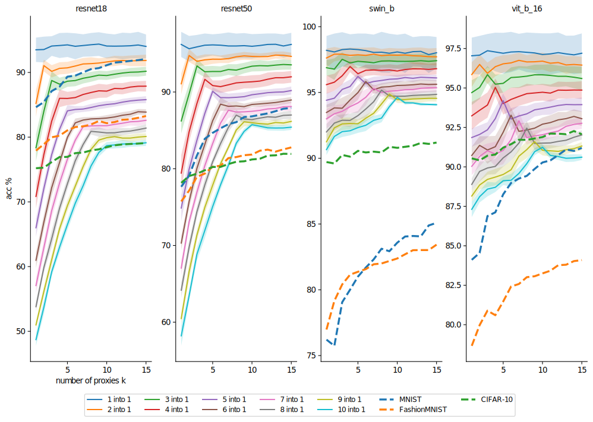

# Robust Weight Imprinting
This repository contains code for the paper **Robust Weight Imprinting: Insights from Neural Collapse and Proxy-Based Aggregation**.
[[Preprint](https://arxiv.org/abs/2503.14572)]

March 2025: Code published upon acceptance.

## Overview of our Imprinting Framework
We test frozen, neurally collapsed foundation models (`FMs`) on transferability to new classes.
The weight generator (`GEN`) uses training data from a novel task `T` to generate one or more weight vectors (proxies) per class $1, \dotsc, c$ given in `T`.
The final output of the test data in `T` is computed by an aggregation (`AGG`) mechanism.
Embeddings and generated weights are normalized according to `NORMpre` and `NORMpost`, respectively.
During inference, embeddings are normalized according to `NORMinf` (not shown here).

In the paper, we investigate the impact and benefits of each component.

## Results
Within the above-described framework, we find the best method by investigating average rank, average accuracy, and statistical significance in ranking (dis-)agreements through cirtical difference diagrams with $p<0.05$.
The rankings are across two `FMs`, `resnet18` and `vit_b_16`, and twelve tasks `T` coming from `MNIST`, `FashionMNIST`, and `CIFAR-10`.

### Comparison to Previous Methods

Previously studied imprinting strategies are special cases within our framework.
The framework enables the creation of a novel configuration ("Ours") that outperforms previous work across `FMs` and `Ts`by a large margin with statistical significance.
It uses multiple proxies per class. Here, $k=20$ is chosen.

| Paper                                              | `NORMpre` | `GEN` | `NORMpost` | `NORMinf` | `AGG`| Avg. acc. %  |
|----------------------------------------------------|---------|---------|----------|---------|-------|--------------|
| [Qi et al.]([https://example.com/qi](https://openaccess.thecvf.com/content_cvpr_2018/html/Qi_Low-Shot_Learning_With_CVPR_2018_paper.html))   | L2      | mean    | L2       | L2      | max   | 87.72        |
| [Hosoda et al.]([https://example.com/hos](https://www.frontiersin.org/journals/neuroscience/articles/10.3389/fnins.2024.1344114/full)) | none    | mean    | quantile | none    | max   | 82.15        |
| [Janson et al.]([https://example.com/](https://arxiv.org/abs/2210.04428)) | none    | mean    | none     | none    | 1-nn  | 87.65        |
| **Ours**                                           | L2      | k-means | L2       | L2      | max   | **91.47**    |

### Connection to Neural Collapse

The central effect of using multi-proxy imprinting with k-means becomes clear when synthetic ImageNet tasks (class distributions are multi-modal by combining $d$ classes into one) are plotted against the number of proxies $k$ used.
In all four plots, peaks in accuracy at $k=d$ can be inferred.
Accuracies of the tasks containing all of `MNIST`, `FashionMNIST`, and `CIFAR-10` at once are shown in dotted lines and show that using one proxy (the `mean`) is not optimal, as the `FM` seems to not be fully collapsed on these OOD classes.
This confirms the connection between the effect of using multiple proxies and the collapse of the data.

