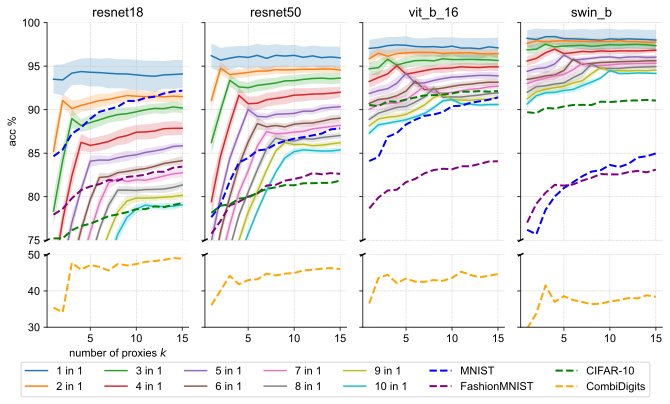

# Robust Weight Imprinting
This repository contains code for the paper **Robust Weight Imprinting: Insights from Neural Collapse and Proxy-Based Aggregation**.
[[Preprint](https://arxiv.org/abs/2503.14572)]

## Overview of our Imprinting Framework
We test frozen, neurally collapsed foundation models (`FMs`) on transferability to new classes.
The weight generator (`GEN`) uses training data from a novel task `T` to generate one or more weight vectors (proxies) per class $1, \dotsc, c$ given in `T`.
The final output of the test data in `T` is computed by an aggregation (`AGG`) mechanism.
Embeddings and generated weights are normalized according to `NORMpre` and `NORMpost`, respectively.
During inference, embeddings are normalized according to `NORMinf` (not shown here).


For more details on the framework implementation and components, please refer to the paper.

## Setup and Running Experiments
There are three main ways to run the experiments reproducing the results in our paper with this repository:
1. Local setup with a virtual environment
2. Docker container
3. (in conjunction with 2.) Kubernetes cluster for large-scale parallel execution

### Local Setup
```bash
# Tested with Python3.10

# Create and activate virtual environment
python -m venv venv
source venv/bin/activate  # On macOS/Linux or venv\Scripts\activate on Windows

# Install requirements
pip install -r requirements.txt

# Install the package in development mode
pip install -e .

# Generate embeddings (required before running experiments)
python scripts/generate_embeddings.py

# Now you can run experiments
python scripts/run_imprinting_experiments.py --config src/config/config_reprod_sec6.1.yaml
```

### Docker and Kubernetes Setup
Build a Docker container via

```bash
docker build -t multi-imprinting .
```

and then, for large-scale parallel execution, use (for example) the Kubernetes job generator:

```bash
# Navigate to the k8s directory
cd k8s

# Generate job files for a specific configuration
python imprinting_jobs_generator.py

# Apply the generated job files
kubectl apply -f generated_imprinting_jobs_reprod/
```

The jobs will run in parallel on your Kubernetes cluster, with results stored in the configured persistent volume.


## Reproducing Experiments from the Paper

To reproduce all the experiments from our paper, run the following configuration files using the `run_imprinting_experiments.py` script:

```bash
# Section 6.1
python scripts/run_imprinting_experiments.py --config src/config/config_reprod_sec6.1.yaml

# Figure 6
python scripts/run_imprinting_experiments.py --config src/config/config_reprod_fig6.yaml

# Section 6.2
python scripts/run_imprinting_experiments.py --config src/config/config_reprod_sec6.2.yaml
python scripts/run_imprinting_experiments.py --config src/config/config_reprod_sec6.2_kls.yaml

# Section 6.3 for ImageNet
python scripts/run_imprinting_experiments.py --config src/config/config_reprod_sec6.3_imagenet.yaml
python scripts/run_imprinting_experiments.py --config src/config/config_reprod_sec6.3_imagenet_kls.yaml

# Section 6.3 for CombiDigits dataset
python scripts/run_imprinting_experiments.py --config src/config/config_reprod_sec6.3_combidigits.yaml
python scripts/run_imprinting_experiments.py --config src/config/config_reprod_sec6.3_combidigits_kls.yaml

# Section 6.3 for other datasets
python scripts/run_imprinting_experiments.py --config src/config/config_reprod_sec6.3_non-imagenet.yaml
python scripts/run_imprinting_experiments.py --config src/config/config_reprod_sec6.3_non-imagenet_kls.yaml
```

### Neural Collapse Experiments

The neural collapse experiments provide insights into the benefits of multi-proxy imprinting and are shown in section 6.3 of the paper:

```bash
python scripts/run_neural_collapse_experiments.py
```

This script calculates the NC1 metric for MNIST, FashionMNIST, CIFAR10, the MNIST&MNIST-M&USPS&SVHN mixed set ("CombiDigits"), and ImageNet with different class remappings.

### Analysis and Visualization

After running the experiments, use the tools in the `analysis/` directory to process and visualize the results:

```bash
# Navigate to the analysis directory
cd analysis

# Run the analysis notebook
jupyter notebook analysis.ipynb
```

The critical difference diagram generation in `cd_diag.py` performs statistical significance testing to compare different imprinting configurations across multiple datasets and backbones.

## Results
Within the above-described framework, we find the best method by investigating average rank, average accuracy, and statistical significance in ranking (dis-)agreements through critical difference diagrams with $p<0.05$.
The rankings are across four `FMs`, `resnet18`, `resnet50`, `vit_b_16`, and `swin_b`, and twelve tasks `T` coming from `MNIST`, `FashionMNIST`, and `CIFAR-10`.

### Comparison to Previous Methods

Previously studied imprinting strategies are special cases within our framework.
The framework enables the creation of a novel configuration ("Ours") that outperforms previous work across `FMs` and `Ts`by a large margin with statistical significance.
It uses multiple proxies per class. Here, $k=20$ is chosen.

| Paper                                                                                                            | `NORMpre` | `GEN`   | `NORMpost` | `NORMinf` | `AGG` | Avg. acc. % |
| ---------------------------------------------------------------------------------------------------------------- | --------- | ------- | ---------- | --------- | ----- | ----------- |
| [Qi et al.](https://openaccess.thecvf.com/content_cvpr_2018/html/Qi_Low-Shot_Learning_With_CVPR_2018_paper.html) | L2        | mean    | L2         | L2        | max   | 85.75       |
| [Hosoda et al.](https://www.frontiersin.org/journals/neuroscience/articles/10.3389/fnins.2024.1344114/full)      | none      | mean    | quantile   | none      | max   | 84.22       |
| [Janson et al.](https://arxiv.org/abs/2210.04428)                                                                | none      | mean    | none       | none      | 1-nn  | 85.59       |
| **Ours**                                                                                                         | L2        | k-means | L2         | L2        | max   | **91.11**   |


### Connection to Neural Collapse

The central effect of using multi-proxy imprinting with k-means becomes clear when synthetic ImageNet tasks (class distributions are multi-modal by combining $d$ classes into one) are plotted against the number of proxies $k$ used.
In all four plots, peaks in accuracy at $k=d$ can be inferred.
Accuracies of the tasks containing all of `MNIST`, `FashionMNIST`, `CIFAR-10`, resp. `CombiDigits` at once are shown in dotted lines and show that using one proxy (the `mean`) is not optimal, as the `FM` seems to not be fully collapsed on these OOD classes.
This confirms the connection between the effect of using multiple proxies and the collapse of the data.


